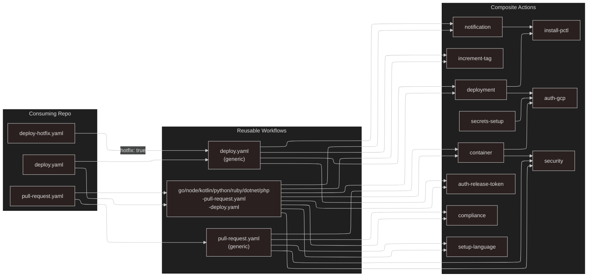
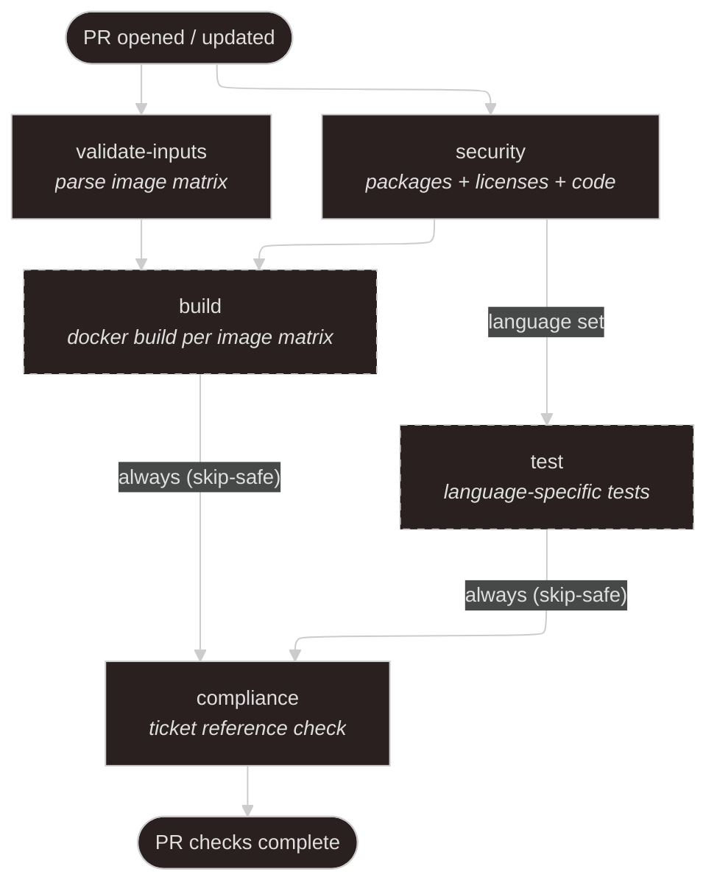
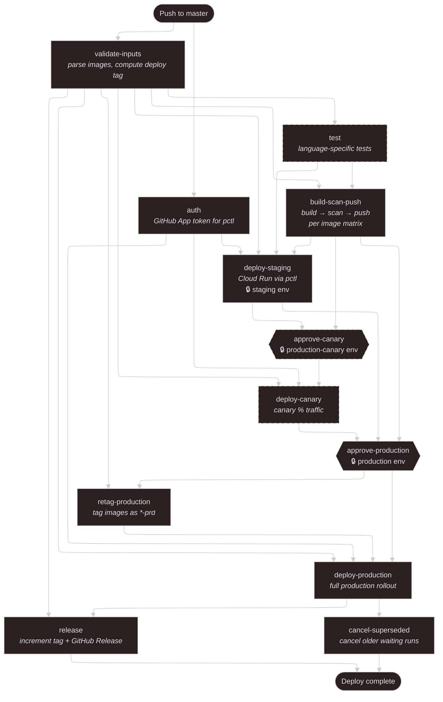
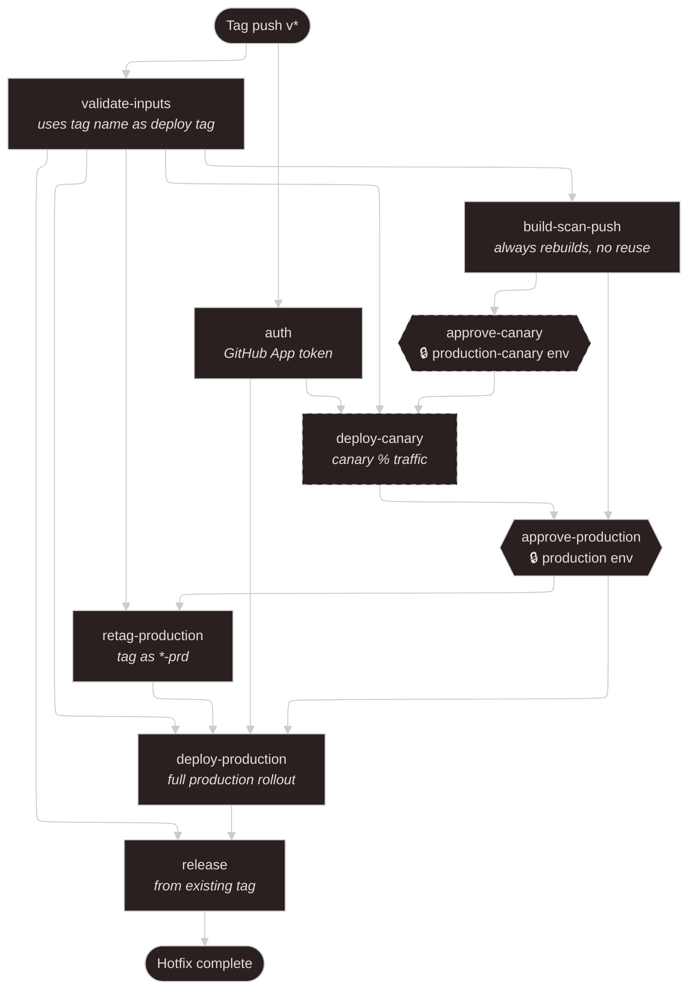
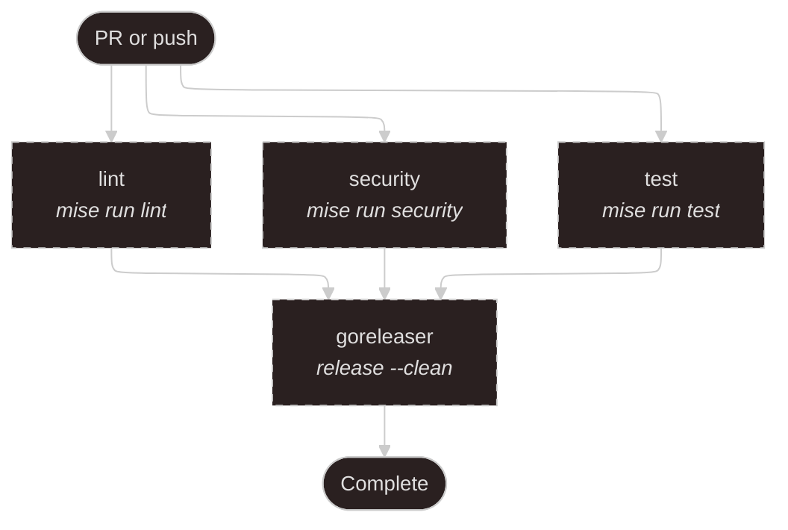
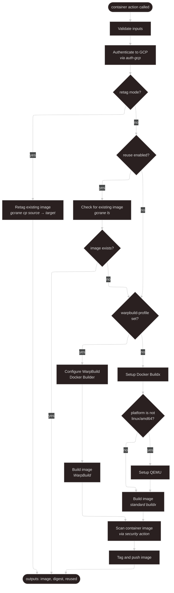
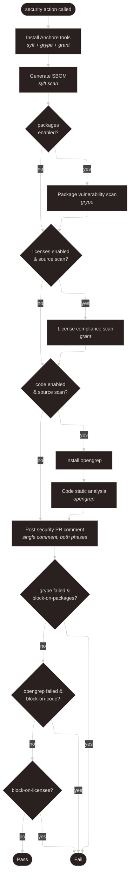
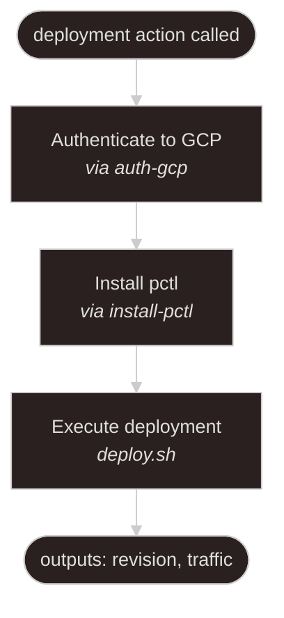

# Usage Guide

Every consuming repo needs one or two workflow files. Pick the language-specific workflow for your stack.

```bash
any-repo/
└── .github/workflows/
    ├── pull-request.yaml    # PR validation (calls a language-specific or generic workflow)
    ├── deploy.yaml          # merge to master → staging → production
    └── deploy-hotfix.yaml   # tag push → straight to production (hotfix)
```

---

## Language-Specific Workflows (Recommended)

The primary interface to platform-workflows. Each language has a matched pair of reusable workflows: one for PR validation and one for deploy. Pick your language, wire up both files, and you are done.

### Available workflows

| Language | PR Workflow                | Deploy Workflow          | Default version |
| -------- | -------------------------- | ------------------------ | --------------- |
| Go       | `go-pull-request.yaml`     | `go-deploy.yaml`         | (from mise)     |
| Node.js  | `node-pull-request.yaml`   | `node-deploy.yaml`       | `20`            |
| .NET     | `dotnet-pull-request.yaml` | `dotnet-deploy.yaml`     | `8.0`           |
| Kotlin   | `kotlin-pull-request.yaml` | `kotlin-deploy.yaml`     | `21`            |
| PHP      | `php-pull-request.yaml`    | `php-deploy.yaml`        | `8.2`           |
| Python   | `python-pull-request.yaml` | `python-deploy.yaml`     | `3.12`          |
| Ruby     | `ruby-pull-request.yaml`   | `ruby-deploy.yaml`       | `3.3`           |

### How it works

Each language workflow uses [mise](https://mise.jdx.dev/) as the default task runner. If your repo has a `mise.toml` with `lint`, `security`, and/or `test` tasks, the workflow picks them up automatically. No extra configuration needed.

For repos not yet on mise, override inputs are available: `lint-command`, `test-command` (all languages except Go, which always uses mise).

### Run-order options

Every language workflow supports a `run-order` input that controls how lint, security, test, and container-build jobs execute:

| Mode | Description |
| ---- | ----------- |
| `linear` | Lint -> Security -> Test -> Container build. Fail-fast: the first failure stops the pipeline. Default for most languages. |
| `parallel` | All jobs run simultaneously. Fastest wall-clock time. Default for Go. |
| `checks-first` | Security runs first, then lint and test run in parallel, then container build. Good for repos where security is the cheapest gate. |

### Examples

**Go** (PR):

```yaml
name: Pull Request
on:
  pull_request:
    branches: [master]

jobs:
  ci:
    uses: credova/platform-workflows/.github/workflows/go-pull-request.yaml@master
    secrets: inherit
```

**Node.js** (PR):

```yaml
name: Pull Request
on:
  pull_request:
    branches: [master]

jobs:
  ci:
    uses: credova/platform-workflows/.github/workflows/node-pull-request.yaml@master
    secrets: inherit
```

**.NET** (PR):

```yaml
name: Pull Request
on:
  pull_request:
    branches: [master]

jobs:
  ci:
    uses: credova/platform-workflows/.github/workflows/dotnet-pull-request.yaml@master
    secrets: inherit
```

**Kotlin** (PR):

```yaml
name: Pull Request
on:
  pull_request:
    branches: [master]

jobs:
  ci:
    uses: credova/platform-workflows/.github/workflows/kotlin-pull-request.yaml@master
    secrets: inherit
```

**PHP** (PR):

```yaml
name: Pull Request
on:
  pull_request:
    branches: [master]

jobs:
  ci:
    uses: credova/platform-workflows/.github/workflows/php-pull-request.yaml@master
    secrets: inherit
```

**Python** (PR):

```yaml
name: Pull Request
on:
  pull_request:
    branches: [master]

jobs:
  ci:
    uses: credova/platform-workflows/.github/workflows/python-pull-request.yaml@master
    secrets: inherit
```

**Ruby** (PR):

```yaml
name: Pull Request
on:
  pull_request:
    branches: [master]

jobs:
  ci:
    uses: credova/platform-workflows/.github/workflows/ruby-pull-request.yaml@master
    secrets: inherit
```

### Shared Release workflow

For SDK and package repos that publish artifacts (npm, NuGet, etc.), use `shared-release.yaml` instead of (or alongside) a deploy workflow. It supports edge and semantic release modes with built-in publishing to npm and NuGet registries.

```yaml
name: Release
on:
  push:
    branches: [master]

jobs:
  release:
    uses: credova/platform-workflows/.github/workflows/shared-release.yaml@master
    secrets: inherit
    with:
      mode: semantic
      publish-npm: true
```

### Dependabot auto-merge

For repos using Dependabot, wire up `dependabot-auto-merge.yaml` to automatically merge patch and minor version updates after CI passes.

```yaml
name: Dependabot Auto-Merge
on:
  pull_request:

jobs:
  auto-merge:
    uses: credova/platform-workflows/.github/workflows/dependabot-auto-merge.yaml@master
```

---

## Generic Pull Request Workflow

> **Note:** The following generic workflows are available as escape hatches for repos that don't fit a language-specific workflow. For most repos, use the language-specific workflows above.

## Pull Request Workflow

One workflow handles everything. Toggle what you need with flags.

### Service (container build - the default)

The simplest case. Builds a Dockerfile, scans it, runs compliance checks. No language setup needed - the Dockerfile handles everything.

```yaml
# .github/workflows/pull-request.yaml
name: Pull Request
on:
  pull_request:
    branches: [master]

jobs:
  ci:
    uses: credova/platform-workflows/.github/workflows/pull-request.yaml@master
```

### Service with explicit image

```yaml
jobs:
  ci:
    uses: credova/platform-workflows/.github/workflows/pull-request.yaml@master
    with:
      image: api:src/Dockerfile
```

### Service with multiple images (monorepo)

```yaml
jobs:
  ci:
    uses: credova/platform-workflows/.github/workflows/pull-request.yaml@master
    with:
      images: |
        - name: api
          dockerfile: ./Dockerfile
        - name: worker
          dockerfile: ./cmd/worker/Dockerfile
```

### Service with tests outside the Dockerfile

Some repos need to run language-specific tests in CI in addition to the container build.

```yaml
jobs:
  ci:
    uses: credova/platform-workflows/.github/workflows/pull-request.yaml@master
    with:
      language: go
      language-version: "1.24"
```

### Non-container repo (CLI, library, scheduled job)

Disable the container build. Language setup and tests run instead.

```yaml
jobs:
  ci:
    uses: credova/platform-workflows/.github/workflows/pull-request.yaml@master
    with:
      language: go
      language-version: "1.24"
      container: false
```

### Custom test command

Override the default test command for your language.

```yaml
jobs:
  ci:
    uses: credova/platform-workflows/.github/workflows/pull-request.yaml@master
    with:
      language: go
      language-version: "1.24"
      container: false
      test-command: "make test-integration"
```

### Supported languages

| Language | `language` value | Version example | Default test command                      |
| -------- | ---------------- | --------------- | ----------------------------------------- |
| Go       | `go`             | `1.24`          | `go test ./...`                           |
| Node.js  | `node`           | `20`            | `npm ci && npm test`                      |
| Kotlin   | `kotlin`         | `21`            | `./gradlew test`                          |
| PHP      | `php`            | `8.2`           | `composer install && vendor/bin/phpunit`  |
| Python   | `python`         | `3.12`          | `pip install -e ".[test]" && pytest`      |
| Ruby     | `ruby`           | `3.3`           | `bundle install && bundle exec rake test` |
| .NET     | `dotnet`         | `8.0`           | `dotnet test`                             |

---

## Go Workflow

For Go repos using [mise](https://mise.jdx.dev/) and [GoReleaser](https://goreleaser.com/).

### PR (lint + security + test only)

```yaml
name: Pull Request
on:
  pull_request:
    branches: [master]

permissions:
  contents: read

jobs:
  go:
    uses: credova/platform-workflows/.github/workflows/go.yaml@master
    secrets: inherit
    with:
      goreleaser: false
```

### Push / tag (with GoReleaser)

GoReleaser needs write permissions for releases, packages, and OIDC signing. Callers **must** declare these - GitHub does not allow reusable workflows to escalate beyond what the caller grants.

```yaml
name: Build and Release
on:
  push:
    branches: [master]
    tags: ["v*"]

permissions:
  contents: write
  packages: write
  id-token: write

jobs:
  go:
    uses: credova/platform-workflows/.github/workflows/go.yaml@master
    secrets: inherit
```

### go.yaml inputs

| Input             | Type    | Default                       | Description                 |
| ----------------- | ------- | ----------------------------- | --------------------------- |
| `lint`            | boolean | `true`                        | Run `mise run lint`         |
| `security`        | boolean | `true`                        | Run `mise run security`     |
| `test`            | boolean | `true`                        | Run tests                   |
| `test-command`    | string  | `""`                          | Custom test command         |
| `goreleaser`      | boolean | `true`                        | Run GoReleaser              |
| `goreleaser-args` | string  | `""`                          | Additional GoReleaser args  |
| `runner`          | string  | `warp-ubuntu-latest-arm64-4x` | GitHub Actions runner label |

### go.yaml secrets

`secrets: inherit` is required. The workflow uses a GitHub App token to fetch mise task includes from `credova/shared-configs`. Without it, `mise run lint` and `mise run security` will fail with 404 errors.

| Secret                              | Required       | Description                                          |
| ----------------------------------- | -------------- | ---------------------------------------------------- |
| `RELEASE_DOWNLOADER_APP_ID`         | Yes            | GitHub App ID - grants read access to shared-configs |
| `RELEASE_DOWNLOADER_APP_PRIVATE_KEY`| Yes            | GitHub App private key                               |
| `HOMEBREW_PUBLISHER_APP_ID`         | Tag builds only| GitHub App ID - publishes to homebrew-tap            |
| `HOMEBREW_PUBLISHER_APP_PRIVATE_KEY`| Tag builds only| GitHub App private key                               |

### GoReleaser Docker (dockers_v2)

GoReleaser v2 replaces `dockers` + `docker_manifests` with a single `dockers_v2` section. This uses `docker buildx build` under the hood, building multi-platform manifests in one step.

**.goreleaser.yaml:**

```yaml
dockers_v2:
  - images:
      - us-docker.pkg.dev/your-project/your-repo/your-image
    tags:
      - "v{{ .Version }}"
      - "{{ if not .IsNightly }}latest{{ end }}"
```

**Dockerfile** - use `$TARGETPLATFORM` to copy the correct binary:

```dockerfile
FROM scratch
ARG TARGETPLATFORM
COPY $TARGETPLATFORM/my-binary /
ENTRYPOINT ["/my-binary"]
```

GoReleaser sets up the build context so each platform's artifacts are in `$TARGETPLATFORM/`. On `--snapshot` builds, platform is appended to tags and images are built instead of manifests (manifests require pushing).

### Local Docker testing

Add file tasks to `mise-tasks/` for local testing:

```bash
# mise-tasks/docker-build
#!/usr/bin/env bash
#MISE description="Build Docker image locally via goreleaser snapshot"
set -euo pipefail
goreleaser release --snapshot --clean

# mise-tasks/docker-test
#!/usr/bin/env bash
#MISE description="Build and run the Docker image locally to verify it works"
#MISE depends=["docker-build"]
set -euo pipefail
IMAGE=$(docker images --format '{{.Repository}}:{{.Tag}}' | grep your-image | head -1)
docker run --rm "$IMAGE" version
```

```bash
chmod +x mise-tasks/docker-build mise-tasks/docker-test
mise run docker-test
```

---

## Generic Deploy Workflow

> **Note:** The following generic deploy workflow is available as an escape hatch for repos that don't fit a language-specific workflow. For most repos, use the language-specific deploy workflows above (e.g. `node-deploy.yaml`, `dotnet-deploy.yaml`).

## Deploy Workflow

One workflow handles everything. Same flags as pull-request plus deployment options.

### Standard service deploy

Merge to master → build → scan → push → staging → approval → production.

```yaml
# .github/workflows/deploy.yaml
name: Deploy
on:
  push:
    branches: [master]

jobs:
  deploy:
    uses: credova/platform-workflows/.github/workflows/deploy.yaml@master
    with:
      config-path: deployments/
    secrets:
      RELEASE_DOWNLOADER_APP_ID: ${{ secrets.RELEASE_DOWNLOADER_APP_ID }}
      RELEASE_DOWNLOADER_APP_PRIVATE_KEY: ${{ secrets.RELEASE_DOWNLOADER_APP_PRIVATE_KEY }}
```

### Service with canary

```yaml
jobs:
  deploy:
    uses: credova/platform-workflows/.github/workflows/deploy.yaml@master
    with:
      config-path: deployments/
      canary: 30
    secrets:
      RELEASE_DOWNLOADER_APP_ID: ${{ secrets.RELEASE_DOWNLOADER_APP_ID }}
      RELEASE_DOWNLOADER_APP_PRIVATE_KEY: ${{ secrets.RELEASE_DOWNLOADER_APP_PRIVATE_KEY }}
```

### Non-container repo (release only - no deploy)

Runs tests, creates a tag and GitHub Release. No container, no Cloud Run.

```yaml
jobs:
  deploy:
    uses: credova/platform-workflows/.github/workflows/deploy.yaml@master
    with:
      language: go
      language-version: "1.24"
      container: false
      deploy: false
```

### Non-container repo that deploys (e.g. pctl as a scheduled Cloud Run job)

Runs tests, builds container, deploys to Cloud Run.

```yaml
jobs:
  deploy:
    uses: credova/platform-workflows/.github/workflows/deploy.yaml@master
    with:
      language: go
      language-version: "1.24"
      config-path: deployments/
    secrets:
      RELEASE_DOWNLOADER_APP_ID: ${{ secrets.RELEASE_DOWNLOADER_APP_ID }}
      RELEASE_DOWNLOADER_APP_PRIVATE_KEY: ${{ secrets.RELEASE_DOWNLOADER_APP_PRIVATE_KEY }}
```

### Multi-image monorepo

```yaml
jobs:
  deploy:
    uses: credova/platform-workflows/.github/workflows/deploy.yaml@master
    with:
      config-path: deployments/
      images: |
        - name: merchant-portal
          dockerfile: apps/merchant-portal/Dockerfile
          canary: 30
        - name: admin-portal
          dockerfile: apps/admin-portal/Dockerfile
    secrets:
      RELEASE_DOWNLOADER_APP_ID: ${{ secrets.RELEASE_DOWNLOADER_APP_ID }}
      RELEASE_DOWNLOADER_APP_PRIVATE_KEY: ${{ secrets.RELEASE_DOWNLOADER_APP_PRIVATE_KEY }}
```

---

## Hotfix Deploy

Same `deploy.yaml` with `hotfix: true`. Skips tests and staging - goes straight to build → [canary] → approve → production. Canary still works if `canary > 0`.

```yaml
# .github/workflows/deploy-hotfix.yaml
name: Deploy Hotfix
on:
  push:
    tags: ["v*"]

jobs:
  hotfix:
    uses: credova/platform-workflows/.github/workflows/deploy.yaml@master
    with:
      config-path: deployments/
      hotfix: true
    secrets:
      RELEASE_DOWNLOADER_APP_ID: ${{ secrets.RELEASE_DOWNLOADER_APP_ID }}
      RELEASE_DOWNLOADER_APP_PRIVATE_KEY: ${{ secrets.RELEASE_DOWNLOADER_APP_PRIVATE_KEY }}
```

---

## Opting Out of Defaults

Security scanning and compliance checks are on by default. Opt out explicitly - visible in the workflow file, reviewable in PRs.

```yaml
jobs:
  ci:
    uses: credova/platform-workflows/.github/workflows/pull-request.yaml@master
    with:
      security-code: false       # Skip static analysis
      compliance-ticket: false   # Skip ticket reference check
```

### What you cannot disable

- **Container scanning after build** - if you build and push, it gets scanned
- **Auth via WIF** - no PATs, no service account keys

---

## WarpBuild

All workflows run on [WarpBuild](https://warpbuild.com) runners by default (`warp-ubuntu-2204-x64-2x`). WarpBuild also provides remote Docker Builders for faster container builds with built-in layer caching.

### Prerequisites

1. **WarpBuild runners** must be configured in your GitHub organization. All workflows default to `warp-ubuntu-2204-x64-2x`. Override with the `runner` input if needed.
2. **WarpBuild Docker Builder** (optional) - to use remote Docker builds, you must first create a Docker Builder profile in the [WarpBuild dashboard](https://app.warpbuild.com). The profile name is passed via the `warpbuild-profile` input.
3. **`WARPBUILD_API_KEY` secret** (optional) - only required if running on non-WarpBuild runners. Not needed when using WarpBuild runners.

### Using WarpBuild Docker Builders

Pass your Docker Builder profile name to enable remote builds:

```yaml
jobs:
  ci:
    uses: credova/platform-workflows/.github/workflows/pull-request.yaml@master
    with:
      warpbuild-profile: my-docker-builder
```

Benefits over standard buildx:

- **Built-in layer caching** - no `cache-to`/`cache-from` configuration needed
- **Native arm64 support** - no QEMU emulation, builds run on real hardware
- **Faster builds** - dedicated remote build infrastructure

### Overriding the runner

To use a different runner (e.g. for repos not yet on WarpBuild):

```yaml
jobs:
  ci:
    uses: credova/platform-workflows/.github/workflows/pull-request.yaml@master
    with:
      runner: ubuntu-latest
```

### Available WarpBuild runners

| Runner | vCPU | RAM | Arch |
| ------ | ---- | --- | ---- |
| `warp-ubuntu-2204-x64-2x` | 2 | 8 GB | x64 |
| `warp-ubuntu-2204-x64-4x` | 4 | 16 GB | x64 |
| `warp-ubuntu-2204-x64-8x` | 8 | 32 GB | x64 |
| `warp-ubuntu-2204-arm64-2x` | 2 | 8 GB | arm64 |
| `warp-ubuntu-2204-arm64-4x` | 4 | 16 GB | arm64 |
| `warp-ubuntu-2204-arm64-8x` | 8 | 32 GB | arm64 |
| `warp-ubuntu-2404-x64-2x` | 2 | 8 GB | x64 |
| `warp-ubuntu-2404-x64-4x` | 4 | 16 GB | x64 |
| `warp-ubuntu-2404-x64-8x` | 8 | 32 GB | x64 |
| `warp-ubuntu-2404-arm64-2x` | 2 | 8 GB | arm64 |
| `warp-ubuntu-2404-arm64-4x` | 4 | 16 GB | arm64 |
| `warp-ubuntu-2404-arm64-8x` | 8 | 32 GB | arm64 |

Default: `warp-ubuntu-2204-x64-2x`. Use 4x/8x for resource-intensive builds only.

### Dependency caching (WarpCache)

Enable `WarpBuilds/cache@v1` for dependency caching. This is a drop-in replacement for `actions/cache` with unlimited storage and better performance on WarpBuild runners.

```yaml
jobs:
  ci:
    uses: credova/platform-workflows/.github/workflows/pull-request.yaml@master
    with:
      language: go
      language-version: "1.24"
      cache: true
```

Cached paths per language:

| Language | Cache path          | Key based on                              |
| -------- | ------------------- | ----------------------------------------- |
| Go       | `~/go/pkg/mod`      | `go.sum`                                  |
| Node.js  | `~/.npm`            | `package-lock.json`, `yarn.lock`          |
| Kotlin   | `~/.gradle/caches`  | `*.gradle*`, `gradle-wrapper.properties`  |
| Python   | `~/.cache/pip`      | `requirements*.txt`, `pyproject.toml`     |
| Ruby     | `vendor/bundle`     | `Gemfile.lock`                            |
| .NET     | `~/.nuget/packages` | `*.csproj`, `packages.lock.json`          |

When `cache: true`, built-in caches from `actions/setup-go` and `actions/setup-node` are automatically disabled to avoid double-caching.

---

## Input Reference

### pull-request.yaml

| Input               | Type    | Default                    | Description                          |
| ------------------- | ------- | -------------------------- | ------------------------------------ |
| `language`          | string  | `""`                       | Language runtime (see table above)   |
| `language-version`  | string  | `""`                       | Runtime version (required w/ lang)   |
| `test-command`      | string  | `""`                       | Custom test command                  |
| `container`         | boolean | `true`                     | Build and scan a container image     |
| `image`             | string  | `""`                       | Single image `name:dockerfile`       |
| `images`            | string  | `""`                       | Multi-image YAML list                |
| `platform`          | string  | `linux/amd64`              | Target platform for builds           |
| `warpbuild-profile` | string  | `""`                       | WarpBuild Docker Builder profile     |
| `cache`             | boolean | `false`                    | WarpBuild dependency caching         |
| `runner`            | string  | see WarpBuild section      | GitHub Actions runner label          |
| `security-packages` | boolean | `true`                     | Package vulnerability scan           |
| `security-code`     | boolean | `true`                     | Code static analysis                 |
| `security-severity` | string  | `HIGH`                     | Minimum severity to fail on          |
| `compliance-ticket` | boolean | `true`                     | Require ticket reference             |

### deploy.yaml

All inputs from pull-request.yaml plus:

| Input                        | Type    | Default        | Description                                                       |
| ---------------------------- | ------- | -------------- | ----------------------------------------------------------------- |
| `deploy`                     | boolean | `true`         | Deploy to Cloud Run via pctl                                      |
| `config-path`                | string  | `deployments/` | Path to CUE config directory                                      |
| `canary`                     | number  | `0`            | Canary traffic percentage                                         |
| `require-approval`           | boolean | `true`         | Require manual approval for production                            |
| `container-reuse`            | boolean | `true`         | Skip build if image exists for this SHA                           |
| `hotfix`                     | boolean | `false`        | Hotfix mode: skip tests, staging, canary - straight to production |
| `notifications`              | boolean | `true`         | Send Slack notifications                                          |
| `project-id`                 | string  | `""`           | GCP project ID                                                    |
| `workload-identity-provider` | string  | `""`           | WIF provider resource name                                        |

**Secrets** (both workflows): `WARPBUILD_API_KEY` (optional - only needed on non-WarpBuild runners).
Deploy also requires: `RELEASE_DOWNLOADER_APP_ID`, `RELEASE_DOWNLOADER_APP_PRIVATE_KEY`.

---

## Architecture Overview

How the two layers connect: reusable workflows are the public interface, composite actions are internal building blocks.



---

## Pipeline Flow

### Pull Request

Jobs run with parallel starts where possible. Dashed borders = conditional (skipped when toggled off).



**Toggle map** — what each input controls:

| Input | What it gates |
| ----- | ------------- |
| `language` + `language-version` | **test** job runs |
| `container` (default: `true`) | **build** job runs |
| `security-packages` | package vulnerability scan inside **security** |
| `security-licenses` | license compliance scan inside **security** |
| `security-code` | static code analysis inside **security** |
| `compliance-ticket` (default: `true`) | ticket reference check inside **compliance** |

### Deploy (standard)

Merge to master triggers the full pipeline. Approval gates are GitHub Environments.



**Toggle map:**

| Input | What it gates |
| ----- | ------------- |
| `language` + `language-version` | **test** job runs |
| `container` (default: `true`) | **build-scan-push** and **retag-production** jobs run |
| `deploy` (default: `true`) | **staging**, **approval**, **canary**, and **production** jobs run |
| `canary` (default: `0`) | **approve-canary** and **deploy-canary** jobs run (set > 0 to enable) |
| `require-approval` (default: `true`) | **approve-production** gate runs |
| `notifications` (default: `true`) | Slack notifications in **deploy-production** |
| `container-reuse` (default: `true`) | **build-scan-push** skips build if image already exists for this SHA |

### Deploy (hotfix)

Tag push with `hotfix: true`. Skips tests and staging — straight to build → production.



**Key differences from standard deploy:** no test job, no staging, no cancel-superseded. Deploy tag is the pushed tag (e.g. `v1.2.3`) instead of the commit SHA.

### Go Workflow

For Go repos using mise and GoReleaser. Three parallel checks, then optional release.



**Toggle map:**

| Input | What it gates |
| ----- | ------------- |
| `lint` (default: `true`) | **lint** job |
| `security` (default: `true`) | **security** job |
| `test` (default: `true`) | **test** job |
| `goreleaser` (default: `true`) | **goreleaser** job (runs `--snapshot` on non-tag builds) |

All four jobs are independently toggleable. GoReleaser waits for the other three.

---

## Composite Action Internals

### container action

The most complex action — handles the full image lifecycle with multiple modes.



### security action

Two-phase scanning. Phase 1 scans source code (`dir:.`), phase 2 scans container images (`docker:<ref>`).



### deployment action

Deploys to Cloud Run via pctl. Self-contained — handles its own auth.



`deploy.sh` supports four actions via the `action` input:
- **deploy** — full deploy (or canary if `canary > 0`)
- **promote** — promote canary to full traffic
- **rollback** — rollback to a previous revision
- **abort** — abort an in-progress canary
